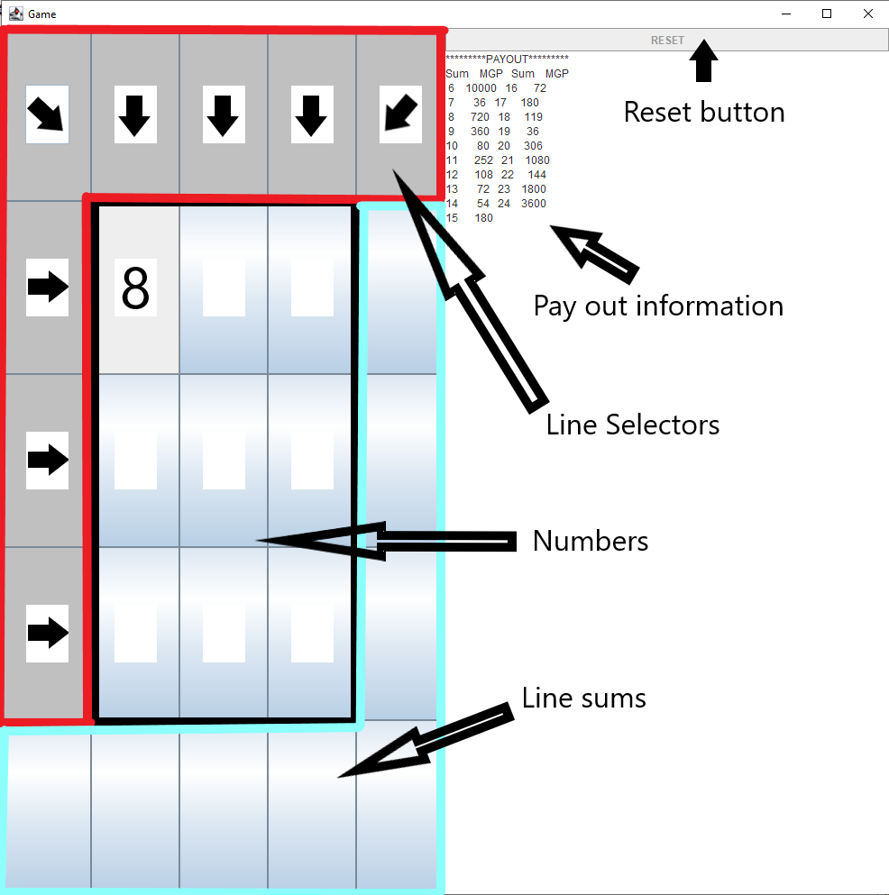
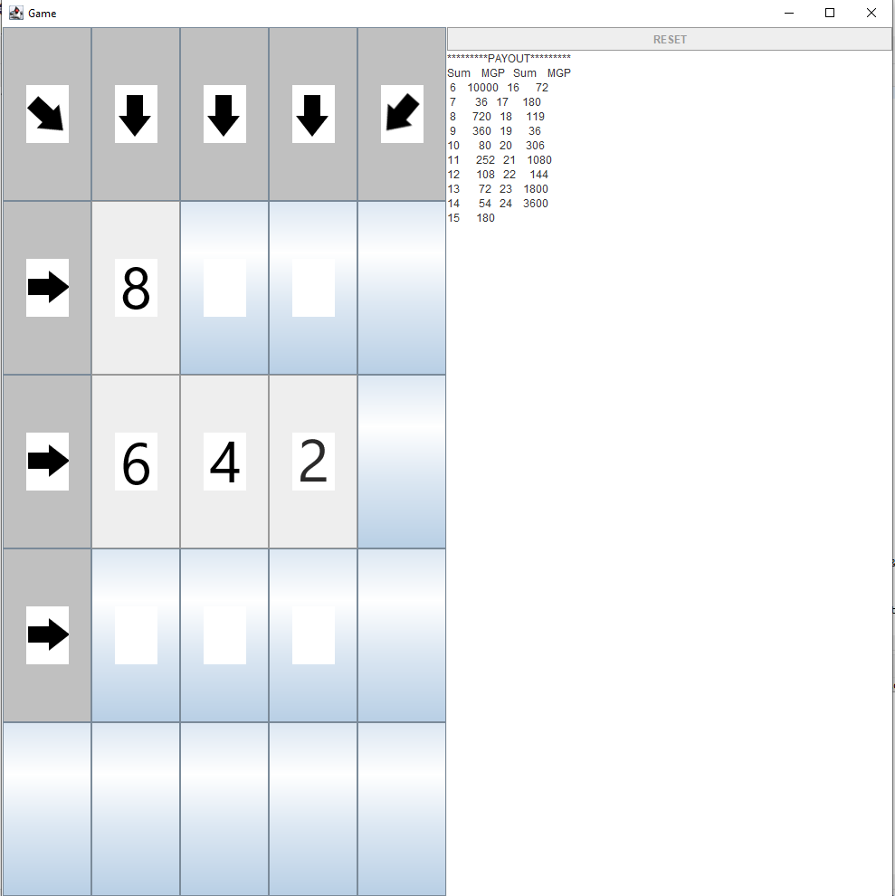
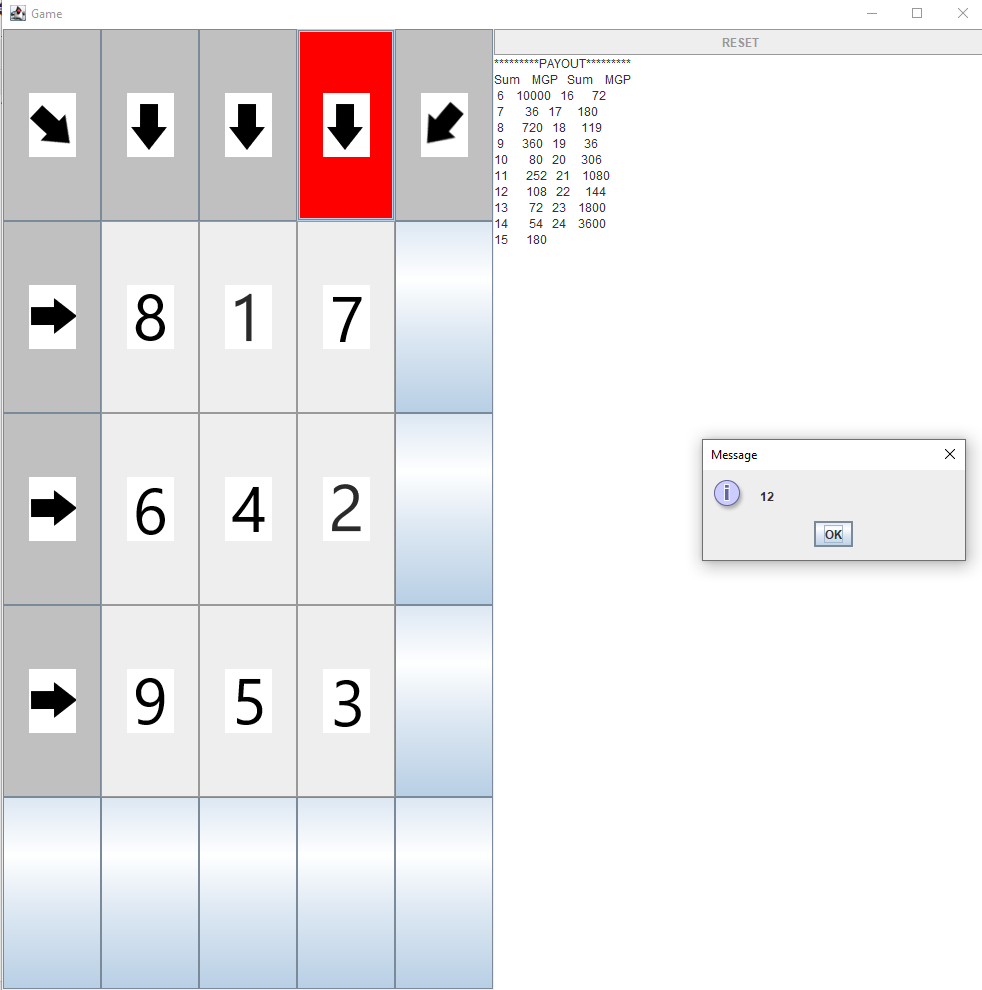
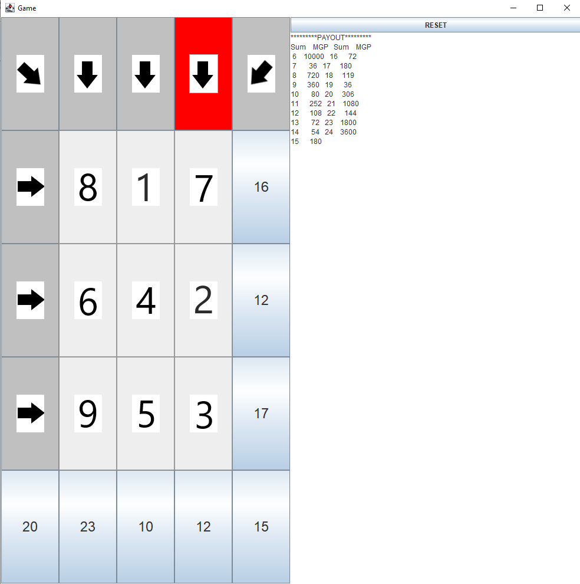

## Welcome to COP1250C Spring 2022 Project Page

PROJECT 1. MINI CACTUS GAME
Objective. To complete a java implementation of FINAL FANTASY® XIV Gold Saucer mini cactpot game.
The game of mini cactpots played on a 3x3 matrix with numbers from 1 to 9 appearing each of them only once. The matrix is filled randomly.  
Game board description
 
Reset button: after the first game, allows to start a new game.
Payout information: rewards based on the sum of the chosen line.
Line selector: buttons with the arrows pointing one of the eight different lines in 
The array of numbers.
Numbers: Three by Three array of numbers between 1 and 9 with no number-
Game Process
- Step1: Choose three uncovered spaces in the board
 
- Step 2: Choose one of the 8 arrows that allows to choose the line of numbers you want to get.
 
- Step 3: See the addition and know how much you are going to get
 
- Step 4: Click the reset button to play again or just use the close button to end the program.

Project rules
The initial project must be forked from github repository:
https://github.com/profclollett/COP1250CSP2022

Import the code and make it run. It should run the game but having the wrong results.
You need to add/substitute code in six methods to make the code works as intended
Here is an extract of the code in which the student needs to make modifications
/*
	 *  STARTING THE SECTION THAT THE STUDENT HAS TO CODE.
	 *  READ CAREFULLY THE DESCRIPTION AND ASK QUESTIONS
	 *  IF NECESSARY
	 */
	
	/*
	 *  Methods 1. Create a String that has a table of rewards
	 *  Make sure that contains the information shown in
	 *  the demo. It does not need to be 100% with the
	 *  same spacing and/or format as the demo. 
	 */
	public String createRewardsTextArea() {
		// Return the proper string for the rewards table
		return "PUT THE REWARDS TABLE HERE";
				
	}
	/*
	 *  Special class for matrix. Only modify the indicated methods
	 */
	private class NumberMatrix{
		private int[][] matrix;
		private final int ROWNUMS=3,COLNUMS=3;
		public NumberMatrix() {
			matrix=new int[ROWNUMS][COLNUMS];
		}
		/*
		 * Method 2. Make this method to populate the parameter matrix
		 * with the number one to nine in an random number and without
		 * repeating any number
		 */
		public void resetMatrix(int[][] matrix) {
			// This is a dummy answer, add the code necessary to fill the array
			for(int i=0;i<3;i++)
				for(int j=0;j<3;j++)
					matrix[i][j]=1;
			
		}
		/*
		 *  To obtain the matrix. Do not change
		 */
		public int[][] getMatrix(){
			return matrix;
		}
		/*
		 *  Method 3. For the matrix and an specific row to return
		 *  the sum of the numbers in that row
		 */
		public int getRowSums(int[][] matrix,int row) {
			// Add code and return the proper number
			return 0;
		}
		/*
		 *  Method 4. For the matrix and an specific column(col) to return
		 *  the sum of the numbers in that column
		 */
		public int getColSums(int[][] matrix,int col) {
			// Add code and return the proper number
						return 0;
		}
		/*
		 *  Method 5. For the matrix return the sum of the direct
		 *  diagonal
		 */
		public int getDirDiagSum(int[][] matrix) {
			// Add code and return the proper number
						return 0;
		}
		/*
		 *  Method 6. For the matrix return the sum of the inverse
		 *  diagonal
		 */
		public int getInvDiagSum(int[][] matrix) {
			// Add code and return the proper number
						return 0;
		}

You are task also to investigate and implement your own github repository and once your code is ready, you submission should be the URL of the github repository containing your final code.
The rubric:
Correctness: 10 pts/method= 60 pts
Readability: 20 pts, based on the comments included in your code
Use of GitHub: 20 pts. Submit a picture of your repository and its URL
Project is graded over 100 and later will be converted to assigned points in the Syllabus. 

